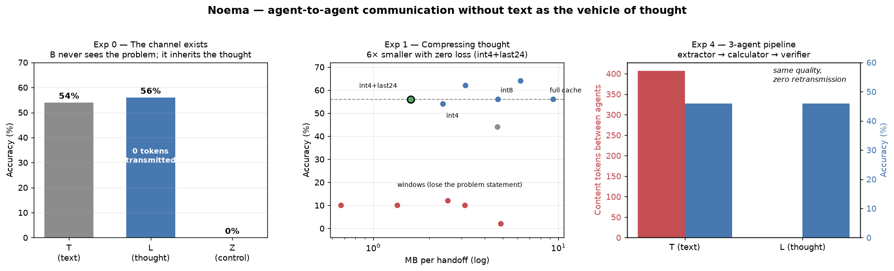
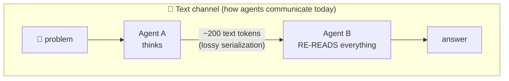
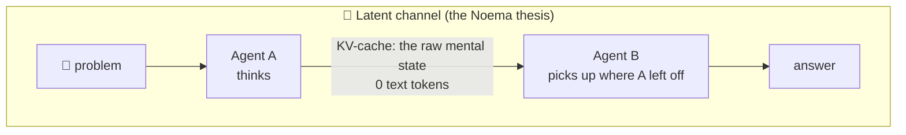
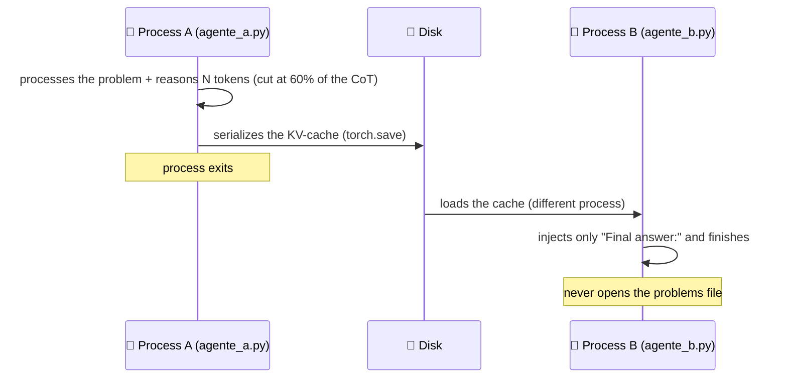

<div align="center">

# 🧠 Noema

### Agent-to-agent communication without text as the vehicle of thought

*Agent A thinks. Agent B continues the thought — without receiving a single word.*

**English** · [Português](README.pt-BR.md)

   



</div>

---

## 💡 The idea in 30 seconds

LLMs reason in a continuous vector space. The text they produce is a **lossy serialization** of that internal state: when agent A explains something to agent B in text, gigabytes of activations become ~200 tokens, and B rebuilds everything from scratch — paying time, compute, and losing nuance at every boundary.

Noema tests the alternative: **transferring the raw internal state** (the KV-cache — the model's "working memory") directly from one agent to another, over disk or network, between separate processes.





In the latent channel, B receives only the fixed suffix `"Final answer:"` — it **never sees the problem or the reasoning** — and still finishes the job, because it inherited the finished thought.

## 📊 Results — five experiments, 50 GSM8K problems each

| # | Experiment | Question | Result | Verdict |
|---|---|---|---|---|
| **0** | [Latent Handoff](noema_exp0/) | Does the channel exist? | **L 56% = T 54%**, control 0%, fidelity KL = 0 | ✅ exists, lossless |
| **1** | [Wire Format](noema_exp1/) | How much of the cache is essential? | **56% at 17% of the bytes** (int4 + 24 layers) | ✅ 6× compression for free |
| **0.5** | [Continuous thought](noema_exp05/) | Can one vector carry a thought? | 0% — degeneration | ❌ requires training the receiver |
| **2** | [Interlingua](noema_exp2/) | Can different models understand each other? | ceiling 6% × bridge 2% × control 0% | ❌ distillation is the bottleneck |
| **4** | [The pipeline](noema_exp4/) | Does a real pipeline benefit? | **L 46% = T 46%** with **0 tokens** between agents | ✅ parity with zero retransmission |

📄 **Full analysis:** [`docs/relatorio-final.md`](docs/relatorio-final.md)

## 🔍 Key findings

1. **The channel exists and is perfect.** B inherits the cache from disk and produces next-token distributions *identical* to what A would produce (KL = 0.000). "B thinks from where A stopped" is a measurement, not a metaphor.
2. **Thought compresses 6× for free.** Quantizing to int4 and dropping the 12 shallow layers keeps accuracy intact at 17% of the bytes. And there are two ways to survive compression: int8 thinks *the same* (KL ≈ 0); int4 thinks *differently and still gets it right* (KL 2.1) — reasoning is robust to state perturbations.
3. **The temporal window collapses** in this regime: the last N tokens of the cache aren't enough, because the problem statement lives at the beginning. The essential information is not (only) at the end of the thought.
4. **Distilling the state into a few vectors kills the thought.** From 9.4 MB to 50 KB, accuracy plummets from 56% to 6% — even with an adapter trained in-domain. Crossing between different models requires training the receiver (an open research frontier).
5. **Redirecting an inherited thought requires the model's grammar.** Raw instruction injected mid-stream: 26%. The same instruction as a structured chat-template turn: 46%. Continuation ≠ redirection.
6. **⚠️ The latent channel is NOT encryption.** The decoder (the model) is public — anyone with the file can extract the content. Security comes from classical cryptography and an audit layer ([details](docs/ideia-roteador-cascata.md)).

## ⚙️ How it works under the hood

No `model.generate()`: every token is an explicit forward pass with `DynamicCache`, for surgical control of the state. The handoff is **real** — separate processes, cache serialized to disk:



## 🖥️ Dashboard — see it working in your browser

The easiest way to experience the project: a local web dashboard with a **live
handoff playground** (type a question, watch A get cut mid-thought and B finish
it having seen zero words), one-click experiment runs with live logs and
adjustable parameters (model, cut point, number of problems), and a results view.

```bash
pip install fastapi uvicorn
cd noema_dashboard
python servidor.py            # → http://localhost:7860
```

Pick any suggested Qwen model (0.5B runs on modest GPUs; 3B reproduces the
paper numbers) or type any HuggingFace model id.

## 🚀 Reproducing

Requirements: Python 3.11, CUDA GPU with ≥8 GB VRAM (the default model takes ~6.5 GB in FP16).

```bash
python -m venv noema_env
noema_env\Scripts\activate                 # Windows  (Linux/macOS: source noema_env/bin/activate)

pip install torch --index-url https://download.pytorch.org/whl/cu121   # GPUs up to Ada (RTX 40xx)
# Blackwell GPUs (RTX 50xx): use  --index-url https://download.pytorch.org/whl/cu128
pip install "transformers>=4.46,<5" accelerate datasets matplotlib
```

```bash
cd noema_exp0
python run_experiment.py --smoke     # 1) validate the protocol (3 problems)
python run_experiment.py --kl        # 2) full Exp 0 + KL fidelity

cd ../noema_exp1
python run_exp1.py                   # 3) compression curves (reuses Exp 0 caches)
python fidelidade_exp1.py            #    + KL per configuration

cd ../noema_exp05 && python run_exp05.py     # 4) continuous thought
cd ../noema_exp2  && python run_exp2.py      # 5) interlingua (downloads Qwen2.5-1.5B)
cd ../noema_exp4  && python run_exp4.py      # 6) the 3-agent pipeline
```

Everything is greedy with `seed 42` — numbers are bit-reproducible on the same hardware. **Without a GPU or network**, each experiment ships an offline mechanical test (`teste_mecanico*.py`) that validates the entire protocol with a tiny randomly-initialized model.

> ⚠️ **Don't use Ollama**: it only exposes a text API. This project requires access to `past_key_values`, hidden states and `inputs_embeds` — HuggingFace Transformers + PyTorch.

## 📁 Structure

```
noema/
├── noema_exp0/    # Exp 0 — the channel: A thinks, serializes the cache; B finishes blind
├── noema_exp1/    # Exp 1 — wire format: quantization × window × layers + KL fidelity
├── noema_exp05/   # Exp 0.5 — continuous thought (hidden states via inputs_embeds)
├── noema_exp2/    # Exp 2 — interlingua: 3B → 1.5B via ridge adapter (3 versions)
├── noema_exp4/    # Exp 4 — pipeline: extractor → calculator → verifier, both channels
├── noema_dashboard/  # 🖥️ local web UI: playground, runs, live logs, results
└── docs/
    ├── relatorio-final.md          # 📄 consolidated analysis of all 5 experiments
    ├── ideia-roteador-cascata.md   # 💡 the product: light→heavy cascade + security note
    └── img/resultados.png
```

Each `noema_exp*/resultados/` folder holds the raw JSONL (one line per problem/condition), the Markdown report and the charts for that experiment.

## ❓ FAQ

<details>
<summary><b>Couldn't Ollama do this?</b></summary>

No — Ollama only exposes a text API (prompt in, text out). Everything Noema needs is behind that closed door: `past_key_values` (the KV-cache we serialize and transfer), hidden states, `inputs_embeds`, and full logits (used to measure fidelity, KL = 0). Ollama's internal prompt cache is an invisible optimization for *your next message in the same session* — Noema uses the cache as a **communication medium between distinct agents in distinct processes**: a transferable, compressible, measurable artifact. Fair nuance: the engine underneath Ollama (llama.cpp) does have slot save/restore that could reproduce the most basic handoff — but none of the scientific instrumentation (per-axis quantization, layer pruning, KL fidelity, embedding injection). That's why this project uses HuggingFace Transformers + PyTorch: it's the level of access the research requires.

</details>

<details>
<summary><b>Isn't this what ChatGPT/Claude workflows already do?</b></summary>

No — it's precisely the contrast. Multi-agent workflows on commercial APIs pass **text** between agents: agent A writes, agent B re-reads and rebuilds the context from scratch at every hop (token cost, re-prefill latency, lost nuance). Commercial APIs don't expose the model's internal state — their prompt caching is a server-side optimization for identical prefixes, not a transferable state. Noema does the handoff one layer below: the raw state travels between processes as a file, with 0 text tokens and measured fidelity. This is only possible with open-weights local models — which is exactly the territory this project explores.

</details>

<details>
<summary><b>Don't the big providers already do this inside their own servers?</b></summary>

Partially yes — and that *validates* Noema's premise rather than undermining it. At the infrastructure layer, providers move KV-caches constantly: prefix caching, and disaggregated inference where the cache crosses the network between prefill and decode servers (Mooncake, vLLM, NVIDIA Dynamo). But their cache reuse is an **identity optimization**: "seen this exact prefix → skip recompute". It only works for the same context, byte for byte — and their *agents* still talk to each other in text. Noema uses the cache as a **semantic channel**: a different agent inherits a reasoning mid-flight and continues or redirects it — and the project measures the science of that channel (compression limits, KL fidelity, what breaks and why). That measurement layer is what you won't find in any provider's docs.

</details>

<details>
<summary><b>Is the latent channel more secure, since humans can't read it?</b></summary>

No — and this matters. The KV-cache contains the data in full, and the decoder (the open-weights model) is public: anyone with the file can extract the content — this repo's own `agente_b.py` is the extraction tool. Unreadable-at-a-glance is obscurity, not security; it also blinds audit tooling. Real protection comes from classical encryption, trust-zone perimeters, and the planned symbolic contract layer (Exp 3). Full note in [`docs/ideia-roteador-cascata.md`](docs/ideia-roteador-cascata.md).

</details>

## 🗺️ Roadmap

- [x] **Exp 0** — the latent channel, calibrated with a negative control
- [x] **Exp 1** — the wire format (bytes × transferred-intelligence curve)
- [x] **Exp 0.5 / Exp 2** — the limits: distillation and cross-model transfer (documented nulls)
- [x] **Exp 4** — the multi-agent pipeline with quality parity
- [ ] **Cascade router** — a light front-door model with uncertainty self-detection, escalating to a heavy one ([design](docs/ideia-roteador-cascata.md))
- [ ] **Exp 2 v2** — interlingua with receiver training (Coconut-style)
- [ ] **Exp 3** — contracts: an auditable symbolic layer on top of the latent channel
- [ ] **The hive** — the pipeline distributed across multiple physical GPUs

---

<div align="center">

*Independent research project — built, measured and documented on a single RTX 3090.*

*"Text is the interface for humans. Between machines, thought."*

</div>
