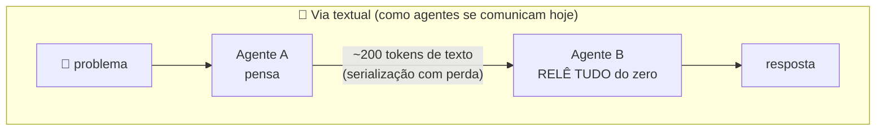
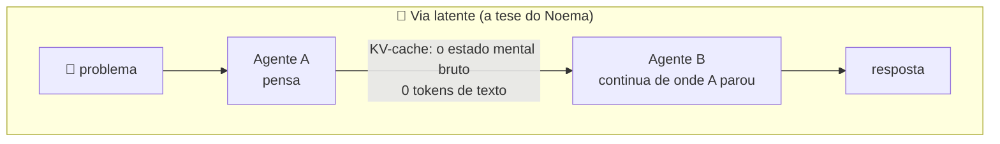
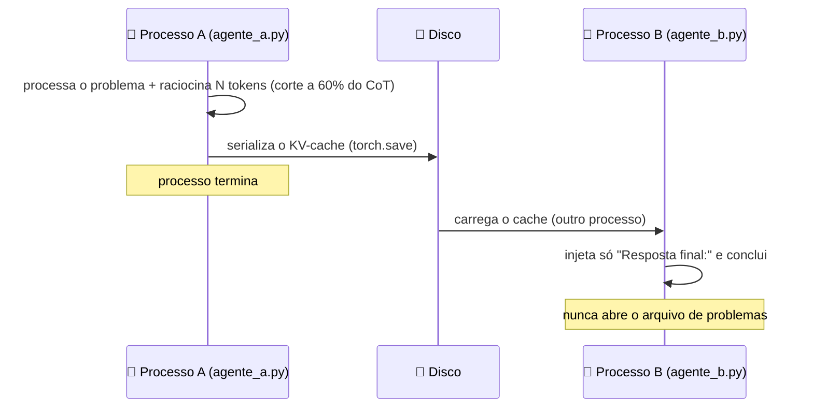

<div align="center">

# 🧠 Noema

### Comunicação entre agentes de IA sem texto como veículo do pensamento

*O agente A pensa. O agente B continua o pensamento — sem receber uma única palavra.*

[English](README.md) · **Português**

   


</div>

---

## 💡 A ideia em 30 segundos

LLMs raciocinam num espaço vetorial contínuo. O texto que produzem é uma **serialização com perda** desse estado interno: quando o agente A explica algo em texto para o agente B, gigabytes de ativações viram ~200 tokens, e B reconstrói tudo do zero — pagando tempo, computação e perdendo nuance a cada fronteira.

O Noema testa a alternativa: **transferir o estado interno bruto** (o KV-cache — a "memória de trabalho" do modelo) diretamente de um agente para outro, por disco ou rede, entre processos separados.





Na via latente, B recebe apenas o sufixo fixo `"Resposta final:"` — **nunca vê o problema nem o raciocínio** — e mesmo assim conclui, porque herdou o pensamento pronto.

## 📊 Resultados — cinco experimentos, 50 problemas do GSM8K cada

| # | Experimento | Pergunta | Resultado | Veredito |
|---|---|---|---|---|
| **0** | [Handoff Latente](noema_exp0/) | O canal existe? | **L 56% = T 54%**, controle 0%, fidelidade KL = 0 | ✅ existe, sem perda |
| **1** | [Wire Format](noema_exp1/) | Quanto do cache é essencial? | **56% com 17% dos bytes** (int4 + 24 camadas) | ✅ compressão 6× grátis |
| **0.5** | [Pensamento contínuo](noema_exp05/) | Um vetor carrega pensamento? | 0% — degeneração | ❌ exige treinar o receptor |
| **2** | [Interlíngua](noema_exp2/) | Modelos diferentes se entendem? | teto 6% × ponte 2% × controle 0% | ❌ destilação é o gargalo |
| **4** | [A esteira](noema_exp4/) | Uma pipeline real compensa? | **L 46% = T 46%** com **0 tokens** entre agentes | ✅ paridade sem retransmissão |

📄 **Leitura completa dos números:** [`docs/relatorio-final.md`](docs/relatorio-final.md)

## 🔍 Principais descobertas

1. **O canal existe e é perfeito.** B herda o cache do disco e produz distribuições de próximo token *idênticas* às que A produziria (KL = 0,000). "B pensa de onde A parou" é medição, não metáfora.
2. **O pensamento comprime 6× de graça.** Quantizar para int4 e cortar as 12 camadas rasas mantém a acurácia intacta com 17% dos bytes. E há duas formas de sobreviver à compressão: int8 pensa *igual* (KL ≈ 0); int4 pensa *diferente e acerta igual* (KL 2,1) — o raciocínio é robusto a perturbações no estado.
3. **A janela temporal colapsa** neste regime: os últimos N tokens do cache não bastam, porque o enunciado mora no início. A informação essencial não está (só) no fim do pensamento.
4. **Destilar o estado em poucos vetores mata o pensamento.** De 9,4 MB para 50 KB, a acurácia despenca de 56% para 6% — mesmo com adaptador treinado no domínio certo. Atravessar entre modelos diferentes exige treinar o receptor (fronteira de pesquisa aberta).
5. **Redirecionar um pensamento herdado exige a gramática do modelo.** Instrução crua no meio do fluxo: 26%. A mesma instrução como turno estruturado do chat template: 46%. Continuação ≠ redirecionamento.
6. **⚠️ O canal latente NÃO é criptografia.** O decodificador (o modelo) é público — quem tem o arquivo extrai o conteúdo. Segurança vem de criptografia clássica e da camada de auditoria ([detalhes](docs/ideia-roteador-cascata.md)).

## ⚙️ Como funciona por dentro

Sem `model.generate()`: cada token é um forward explícito com `DynamicCache`, para controle cirúrgico do estado. O handoff é **real** — processos separados, cache serializado em disco:



## 🚀 Reprodução

Requisitos: Python 3.11, GPU CUDA com ≥8 GB VRAM (o modelo padrão ocupa ~6,5 GB em FP16).

```bash
python -m venv noema_env
noema_env\Scripts\activate                 # Windows  (Linux/macOS: source noema_env/bin/activate)

pip install torch --index-url https://download.pytorch.org/whl/cu121   # GPUs até Ada (RTX 40xx)
# GPUs Blackwell (RTX 50xx): use  --index-url https://download.pytorch.org/whl/cu128
pip install "transformers>=4.46,<5" accelerate datasets matplotlib
```

```bash
cd noema_exp0
python run_experiment.py --smoke     # 1) valida o protocolo (3 problemas)
python run_experiment.py --kl        # 2) Exp 0 completo + fidelidade KL

cd ../noema_exp1
python run_exp1.py                   # 3) curvas de compressão (usa os caches do Exp 0)
python fidelidade_exp1.py            #    + KL por configuração

cd ../noema_exp05 && python run_exp05.py     # 4) pensamento contínuo
cd ../noema_exp2  && python run_exp2.py      # 5) interlíngua (baixa o Qwen2.5-1.5B)
cd ../noema_exp4  && python run_exp4.py      # 6) a esteira de 3 agentes
```

Tudo greedy com `seed 42` — os números são reprodutíveis bit a bit no mesmo hardware. **Sem GPU/rede**, cada experimento tem um teste mecânico offline (`teste_mecanico*.py`) que valida o protocolo inteiro com um modelo minúsculo de pesos aleatórios.

> ⚠️ **Não use Ollama**: ele só expõe API de texto. Este projeto exige acesso a `past_key_values`, hidden states e `inputs_embeds` — HuggingFace Transformers + PyTorch.

## 📁 Estrutura

```
noema/
├── noema_exp0/    # Exp 0 — o canal: A pensa, serializa o cache; B conclui às cegas
├── noema_exp1/    # Exp 1 — wire format: quantização × janela × camadas + fidelidade KL
├── noema_exp05/   # Exp 0.5 — pensamento contínuo (hidden states via inputs_embeds)
├── noema_exp2/    # Exp 2 — interlíngua: 3B → 1.5B via adaptador ridge (3 versões)
├── noema_exp4/    # Exp 4 — esteira: extrator → calculador → verificador, 2 vias
└── docs/
    ├── relatorio-final.md          # 📄 leitura consolidada dos 5 experimentos
    ├── ideia-roteador-cascata.md   # 💡 o produto: cascata leve→pesado + nota de segurança
    └── img/resultados.png
```

Cada `noema_exp*/resultados/` guarda os JSONL brutos (uma linha por problema/condição), o relatório em Markdown e os gráficos daquele experimento.

## ❓ FAQ

<details>
<summary><b>O Ollama não poderia fazer isso?</b></summary>

Não — o Ollama só expõe API de texto (prompt entra, texto sai). Tudo que o Noema precisa fica atrás dessa porta: `past_key_values` (o KV-cache que serializamos e transferimos), hidden states, `inputs_embeds` e os logits completos (usados pra medir a fidelidade, KL = 0). O prompt cache interno do Ollama é uma otimização invisível para *a sua próxima mensagem na mesma sessão* — o Noema usa o cache como **meio de comunicação entre agentes distintos em processos distintos**: um artefato transferível, comprimível e mensurável. Nuance justa: o motor embaixo do Ollama (llama.cpp) tem save/restore de slot que reproduziria o handoff mais básico — mas nada da instrumentação científica (quantização por eixo, corte de camadas, KL de fidelidade, injeção de embeddings). Por isso o projeto usa HuggingFace Transformers + PyTorch: é o nível de acesso que a pesquisa exige.

</details>

<details>
<summary><b>Não é o que os workflows do ChatGPT/Claude já fazem?</b></summary>

Não — é justamente o contraste. Workflows multi-agente em APIs comerciais passam **texto** entre os agentes: A escreve, B relê e reconstrói o contexto do zero a cada salto (custo de tokens, latência de re-prefill, perda de nuance). As APIs comerciais não expõem o estado interno do modelo — o prompt caching delas é otimização de servidor para prefixos idênticos, não um estado transferível. O Noema faz o handoff uma camada abaixo: o estado bruto viaja entre processos como arquivo, com 0 tokens de texto e fidelidade medida. Isso só é possível com modelos locais de pesos abertos — exatamente o território que este projeto explora.

</details>

<details>
<summary><b>Os grandes provedores já não fazem isso dentro dos próprios servidores?</b></summary>

Em parte sim — e isso *valida* a premissa do Noema em vez de miná-la. Na camada de infraestrutura, os provedores movem KV-cache o tempo todo: prefix caching e inferência desagregada, onde o cache atravessa a rede entre os servidores de prefill e decode (Mooncake, vLLM, NVIDIA Dynamo). Mas o reuso deles é uma **otimização de identidade**: "já vi esse prefixo exato → não recalculo". Só funciona para o mesmo contexto, byte a byte — e os *agentes* deles continuam trocando texto entre si. O Noema usa o cache como **canal semântico**: um agente diferente herda um raciocínio no meio do caminho e o continua ou redireciona — e o projeto mede a ciência desse canal (limites de compressão, fidelidade KL, o que quebra e por quê). Essa camada de medição é o que não existe em documentação de provedor nenhum.

</details>

<details>
<summary><b>O canal latente é mais seguro, já que humanos não conseguem ler?</b></summary>

Não — e isso importa. O KV-cache contém os dados integralmente, e o decodificador (o modelo de pesos abertos) é público: quem tem o arquivo extrai o conteúdo — o próprio `agente_b.py` deste repositório é a ferramenta de extração. Ilegível a olho nu é obscuridade, não segurança; e ainda cega as ferramentas de auditoria. Proteção real vem de criptografia clássica, perímetros de confiança e da camada de contratos simbólicos planejada (Exp 3). Nota completa em [`docs/ideia-roteador-cascata.md`](docs/ideia-roteador-cascata.md).

</details>

## 🗺️ Roadmap

- [x] **Exp 0** — o canal latente, calibrado e com controle negativo
- [x] **Exp 1** — o formato de transmissão (curva bytes × inteligência transferida)
- [x] **Exp 0.5 / Exp 2** — os limites: destilação e travessia entre modelos (nulos documentados)
- [x] **Exp 4** — a esteira multi-agente com paridade de qualidade
- [ ] **Roteador em cascata** — modelo leve na porta de entrada com autodetecção de incerteza, escalando para o pesado ([desenho](docs/ideia-roteador-cascata.md))
- [ ] **Exp 2 v2** — interlíngua com treino do receptor (Coconut-style)
- [ ] **Exp 3** — contratos: camada simbólica auditável sobre o canal latente
- [ ] **A colmeia** — a esteira distribuída em várias GPUs físicas

---

<div align="center">

*Projeto de pesquisa independente — construído, medido e documentado em uma RTX 3090.*

*"O texto é a interface com o humano. Entre máquinas, o pensamento."*

</div>
