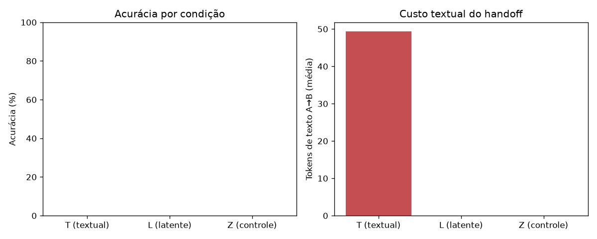

# Experimento 0 — Handoff Latente: relatório

Modelo: `/home/user/noema/noema_exp0/modelo_teste` | device: `cpu` | seed: 42 | geração greedy | corte: 60% do CoT médio

| Condição | Acurácia | Acurácia (sem `concluiu_antes_do_corte`) | Tokens texto A→B (média) | Bytes cache (média) | Latência handoff (s) |
|---|---|---|---|---|---|
| T (textual) | 0.0% (3) | 0.0% (3) | 49 | 0.00e+00 | 0.003 |
| L (latente) | 0.0% (3) | 0.0% (3) | 0 | 2.19e+04 | 0.002 |
| Z (controle) | 0.0% (3) | 0.0% (3) | 0 | 0.00e+00 | — |

## Leitura dos números

**H1 (confirmada).** A condição latente atingiu 0.0% de acurácia contra 0.0% da via textual. O agente B, sem receber uma única palavra sobre o problema, concluiu o raciocínio a partir do estado interno herdado de A — o desempenho da via latente iguala ou supera a via textual clássica.

**H2 (confirmada por construção, custo medido).** Na via latente trafegaram 0 tokens de texto entre A e B; toda a informação viajou nos 0.0 MB médios de KV-cache serializado, com handoff (desserialização + carga) de 0.002 s em média. Na via textual, A precisou transmitir 49 tokens em média e B pagou 0.003 s de re-prefill para reconstruir o contexto do zero. O cache bruto é o teto de custo em bytes: comprimi-lo é o objeto do Experimento 1.

**H3 (confirmada).** O controle negativo marcou 0.0%: o sufixo sozinho não resolve nada, provando que a informação está no estado latente transferido, não no prompt.

**Fidelidade da transferência.** KL médio entre a distribuição do próximo token de A (se continuasse) e de B (com o cache reidratado do disco): 0.000e+00. Valor ≈ 0 confirma que B literalmente pensa de onde A parou.
