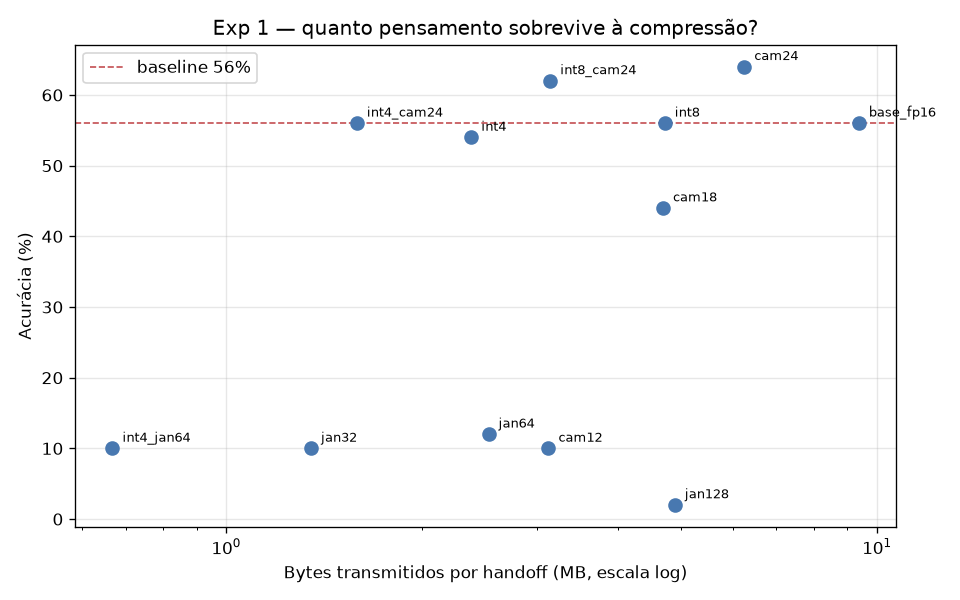

# Experimento 1 — Wire Format: relatório

Modelo: `Qwen/Qwen2.5-3B-Instruct` | 50 problemas GSM8K | caches do Exp 0 | geração greedy, seed 42

| Configuração | Acurácia | MB/handoff | % do original | Handoff (s) |
|---|---|---|---|---|
| cache completo fp16 (baseline = condição L do Exp 0) | 56.0% | 9.38 | 100% | 0.020 |
| só as últimas 24 camadas (de 36) | 64.0% | 6.25 | 67% | 0.016 |
| janela: 4 âncoras + últimos 128 tokens | 2.0% | 4.89 | 52% | 0.020 |
| quantizado int8 | 56.0% | 4.72 | 50% | 0.040 |
| só as últimas 18 camadas (de 36) | 44.0% | 4.69 | 50% | 0.013 |
| int8 + últimas 24 camadas | 62.0% | 3.15 | 34% | 0.029 |
| só as últimas 12 camadas (de 36) | 10.0% | 3.13 | 33% | 0.010 |
| janela: 4 âncoras + últimos 64 tokens | 12.0% | 2.53 | 27% | 0.020 |
| quantizado int4 | 54.0% | 2.38 | 25% | 0.051 |
| int4 + últimas 24 camadas | 56.0% | 1.59 | 17% | 0.037 |
| janela: 4 âncoras + últimos 32 tokens | 10.0% | 1.35 | 14% | 0.019 |
| int4 + janela de 64 (combinação agressiva) | 10.0% | 0.67 | 7% | 0.049 |

