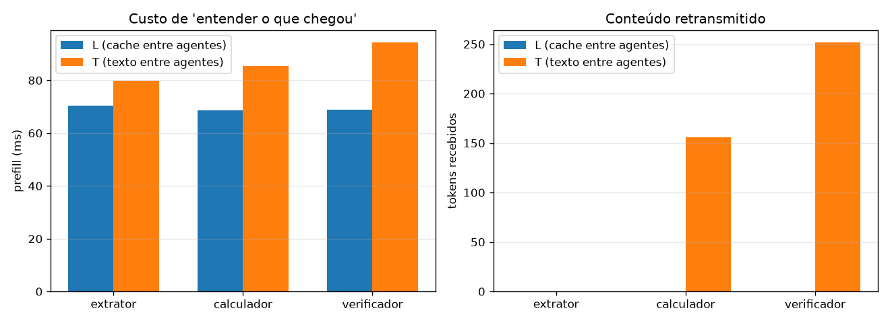

# Experimento 4 — A esteira: 3 agentes, um pensamento

Modelo: `Qwen/Qwen2.5-3B-Instruct` | 50 problemas GSM8K | greedy, seed 42 | esteira: extrator → calculador → verificador

Os três agentes compartilham o checkpoint e diferem no papel. A porta de entrada (etapa 0) é idêntica nas duas vias; o que muda são os **dois saltos** seguintes.

| Via | Acurácia | Conteúdo retransmitido | Cache trafegado | Prefill dos saltos | Handoff | Esteira completa |
|---|---|---|---|---|---|---|
| L (cache entre agentes) | 26.0% | 0 tokens | 17.23 MB | 137 ms | 43 ms | 12.18 s |
| T (texto entre agentes) | 42.0% | 407 tokens | 0.00 MB | 180 ms | 0 ms | 30.24 s |

### Custo por etapa (prefill = reentender o que chegou)

| Etapa | Papel | Prefill L | Prefill T | Tokens recebidos T |
|---|---|---|---|---|
| 0 | extrator | 70 ms | 80 ms | 0 |
| 1 | calculador | 69 ms | 85 ms | 156 |
| 2 | verificador | 69 ms | 94 ms | 252 |

## Leitura

**Comunicação.** A esteira latente atravessou os dois saltos com 0 tokens de conteúdo retransmitido (só as instruções fixas de papel viajam como texto); a textual precisou de 407 tokens em média — cada agente relendo o problema e o trabalho dos anteriores.

**Custo de transferência.** Somando handoff + prefill nos dois saltos: 181 ms na via latente contra 180 ms na textual — **1.0× mais barato** passar o pensamento do que reconstruí-lo. O gasto cresce com o comprimento da esteira: na via textual o último agente relê tudo que veio antes, enquanto na latente o custo de herdar é praticamente constante.

**Qualidade.** Acurácia final: 26.0% (latente) × 42.0% (textual) — o barateamento veio com perda de acurácia.

